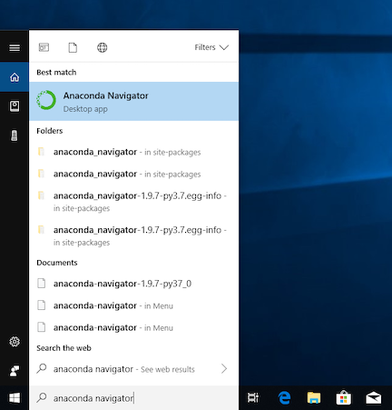

# Installing Python

We are going to use the the Anaconda python distribution. Anaconda has a built in package manager and environment manager (conda) 
that you use with command line commands at the Anaconda Prompt for Windows, or in a terminal window for macOS or Linux.
It helps to avoid problems during the installation process of some packages. 

## Installing on Windows

Download the last version from [Anaconda website]( https://www.anaconda.com/distribution/#windows). Always use python 3+.
[python 2.7](https://pythonclock.org/) will not be maintained past 2020. 

To install it is easy, double click the installer to launch. Follow the instructions. During the installation it will be
shown a message to add Anaconda to the PATH. I recommend to select this option if this is the first python distribution
you are installing. Unless you plan on installing and running multiple versions of
Python, accept the default and leave this box checked.

This will install the following application

## Installing on macOS
 
Download the last version from [Anaconda website]( https://www.anaconda.com/downloads#macos). Always use python 3+.
[python 2.7](https://pythonclock.org/) will not be maintained past 2020. 

To install it is easy, double click the installer to launch. Follow the instructions. 
After your install is complete, verify it by opening Anaconda Navigator. From Launchpad, 
select Anaconda Navigator. If Navigator opens, you have successfully installed Anaconda. 

It is possible to install using command line. Please follow the instruction from the 
[website](https://docs.anaconda.com/anaconda/install/mac-os/)

## Installing on linux
Follow the instruction from the  [website](https://docs.anaconda.com/anaconda/install/linux/)

## Verifying your installation
You can confirm that Anaconda is installed and working with Anaconda Navigator or conda.

You can also use conda in a terminal, command prompt on Windows or terminal on Linux or macOS).
On Windows, there is an option of using Anaconda Prompt (Click Start, select Anaconda Prompt)

After opening Anaconda prompt (terminal on Linux or macOS), choose any of the following methods:

Enter a command such as `conda list`. If Anaconda is installed and working, this will display a 
list of installed packages and their versions.
Enter the command `python`. This command runs the Python shell.
 If Anaconda is installed and working, the version information it displays when it 
 starts up will include “Anaconda”. To exit the Python shell, enter the command `quit()`.
Open Anaconda Navigator with the command anaconda-navigator. 
If Anaconda is installed properly, the graphical program Anaconda Navigator will open.

# Jupyter Notebooks

We are going to use jupyter notebooks during the lessons.